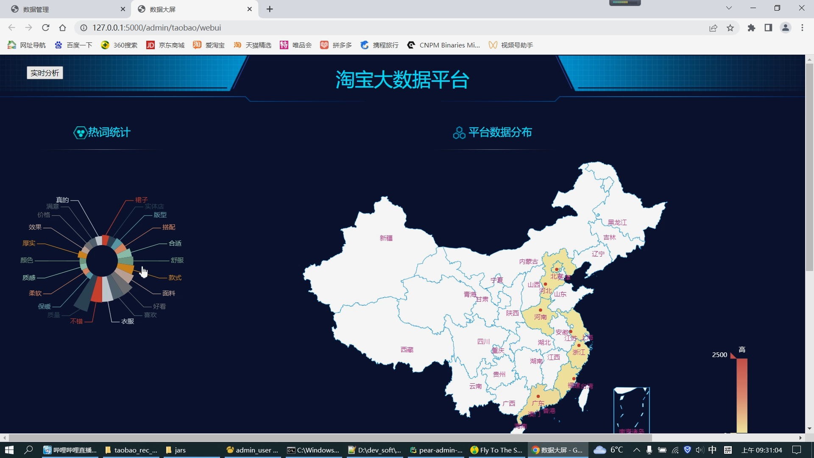

# 计算机毕业设计吊炸天遥遥领先PySpark+Hadoop淘宝商品评论情感分析 淘宝商品推荐系统 淘宝商品数据分析 电商大数据 电商可视化 大数据毕业设计 大数据毕设

## 要求
### 源码有偿一套(论文 PPT 源码+sql脚本+虚拟机)
### 
### 加好友前帮忙start一下，并备注github有偿获取源码
### 我的QQ号是2877135669 

### 或者 微信 bysj2023nb

### 加qq好友说明（被部分  网友整得心力交瘁）：
    1.加好友务必按照格式备注git虚拟机电影推荐
    2.避免浪费各自的时间

# 多说几句：

整体业用户需要注册的时候通过邮箱验证码接收验证码完成注册，然后可以登陆务流程，做个登录页，新。登录进去以后，有个爬取数据的列表分页，支持多条件查询，上面有个爬取按钮，点一下就可以爬取数据更新列表。还有一个协同过滤商品推荐菜单，不同的用户登录能够推荐不同的商品，这里要注意新用户登录也要可以推荐，但是登陆完浏览完收藏完以后下次登录推荐的又不一样了(下次可调用协同过滤).
有一个大屏统计图菜单连接，点一下，直接打开新窗口调转到单独一个新页面：PySpark大屏

# 功能需求描述
数据爬取用selenium爬完商品、评论等等数据，清洗下杂质不完整的数据，把他们过滤掉，留下完整齐全的数据信息存到mysql。
有注册/登录功能，注册需要邮箱验证码。
登录成功进入以后有一个爬取数据的分页列表，支持多条件查询，上面有个爬取按钮，点一下直接吊爬虫脚本完成爬取，更新列表。
有个协同过滤推荐算法推荐商品功能，新用户随机推荐，新用户第二次登录，如果之前浏览收藏过商品的话，进行协同过滤推荐
有个大屏的超链接，点一下直接打开新窗口跳转到Spark大屏，大屏数据包含评论情感分析的词云(可调接口)、其余统计数据也要做的直观全面，图表要多一点！
这个项目2022年11月底完成 大概在11月25号附近

## 开发技术
pyspark hadoop mysql 爬虫 echarts大屏

## 创新点
爬虫 大屏 情感分析 Spark 协同过滤推荐算法

## 补充说明
适合大数据毕业设计、数据分析、爬虫类计算机毕业设计

# 运行截图

# 演示视频

https://www.bilibili.com/video/BV18e4y1g7Jp/?spm_id_from=333.999.0.0